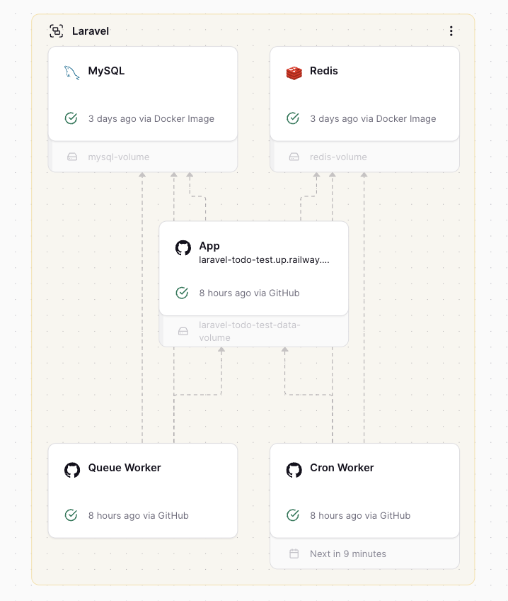

# 

# Laravel

<div class="absolute left-50px bottom-30px">

Carlos Precioso / Wasp Internal / 2025

</div>

---
layout: center
---

# What is Laravel?

PHP framework for creating web application _servers_.

---

## Illuminate

- A dependency injection container <v-click> _&larr; this is why it's for servers_ </v-click>
- An HTTP router

<p />

## `Illuminate\DB` (Eloquent)

- A migration framework
- A query builder
- An ORM

<p />

## Random utils

- Logging
- Common helpers for strings, arrays, etc.

---
layout: center
---

#### Q:

# Why is Laravel nice?

All of these are nice, but normal enough in any web framework <v-click> _\*_ </v-click>

<v-click>

#### A:

# Laravel is not the core libraries,<br/>but the **ecosystem**

</v-click>

---
layout: fact
---

## The Laravel ecosystem is _complete_, _curated_, and _cohesive_.

<v-click>

## The Laravel ecosystem is not _huge_, _strongly coupled_, or _permeable_.

</v-click>

---
layout: image
image: ./assets/ecosystem-screenshot.png
backgroundSize: contain
---

<div v-click class="border-2 border-gray-400 rounded-lg bg-gray-800 p-4 text-white shadow-lg mx-auto absolute right-30px bottom-30px">

They are all branded!

</div>

---

# Example: How to link accounts with GitHub?

<v-clicks>

1. Go to the Laravel website

1. Search in the documentation for "GitHub"

1. Find the `Socialite` package\
   _It looks official, and the docs are in the same section and style as the rest of Laravel's docs_

1. `composer require laravel/socialite`

1. Copy-paste the first three code blocks from the documentation

</v-clicks>

---

<v-switch>

<template #0>

```php [config/services.php]
return [
    "github" => [
        "client_id" => env("GITHUB_CLIENT_ID"),
        "client_secret" => env("GITHUB_CLIENT_SECRET"),
        "redirect" => env(
            "GITHUB_REDIRECT_URI",
            "https://localhost:3000/auth/callback",
        ),
    ],
];
```

```shell [.env.local]
GITHUB_CLIENT_ID=your-client-id
GITHUB_CLIENT_SECRET=your-client-secret
GITHUB_REDIRECT_URI=http://localhost:8000/auth/callback
```

</template>

<template #1>

```php [routes/web.php]
use Laravel\Socialite\Facades\Socialite;

Route::get("/auth/redirect", function () {
    return Socialite::driver("github")->redirect();
});

Route::get("/auth/callback", function () {
    $user = Socialite::driver("github")->user();

    // $user->token
});
```

</template>

<template #2>

```php [routes/web.php]
use App\Models\User;
use Illuminate\Support\Facades\Auth;
use Laravel\Socialite\Facades\Socialite;

Route::get("/auth/callback", function () {
    $githubUser = Socialite::driver("github")->user();

    $user = User::updateOrCreate(
        [
            "github_id" => $githubUser->id,
        ],
        [
            "name" => $githubUser->name,
            "email" => $githubUser->email,
            "github_token" => $githubUser->token,
            "github_refresh_token" => $githubUser->refreshToken,
        ],
    );

    Auth::login($user);

    return redirect("/dashboard");
});
```

</template>

</v-switch>

---
layout: fact
---

# It's like this for everything

---

But if it's just libraries, why is Laravel considered a "framework"? <v-click> _Consistent conventions_ </v-click>

<p/>

<v-click>

Plugins have two ways of integrating with Laravel:

- _"load"_

    It loads your code (from the module's folder) into the discovery systems of the framework. For example, registering their `Services` in the injection container, or providing views and view components to use in your own routes.

- _"publish"_

    It copies bundled files from the module's folder into the app's directories, initializing it with default values but allowing complete customization. For example, copying `config/*.php` files, database migrations, or frontend assets.

Both can be combined to have strike a good balance between convention, configuration, and customization. Having a curated ecosystem where everything works this way makes it easy to learn and use.

And the starter pack has everything you need to get started.

</v-click>

---
src: ./frontend.md
---

---

# Access Control with Laravel Policies

- Define authorization logic for models
- Stored in `app/Policies`
- Automatically discovered and applied

<!-- prettier-ignore -->
<<< ../app/Policies/TaskPolicy.php {9-20|33-44}{lines:true,maxHeight:'300px'}

---

# Access Control with Laravel Policies

From a controller

```php
public function update(Request $request, Post $post)
{
    $this->authorize('update', $post);

    // Update logic...
}
```

From a view

```blade
@can('update', $post)
    <button>Edit Post</button>
@endcan
```

From a middleware

```php
Route::put("/posts/{post}", [PostController::class, "update"])->middleware(
    "can:update,post",
);
```

---
layout: two-cols
---

<!-- prettier-ignore -->
<<< ../Dockerfile docker {*}{lines:true,maxHeight:'500px'}

::right::

<div class="w-full h-auto flex justify-center items-center">

{class="max-w-full h-auto object-contain"}

</div>

---
layout: center
---

# What does Laravel do worse than us?

- **Deployment**: It's a pain, especially when you add queues or scheduled jobs
- **Client-side interactivity**: needs extra tools and setup, either you use simple stuff (Livewire, Alpine.js) or a full SPA (Inertia.js) and you lose server-side rendering
- **Types**: ...it's PHP after all

---
layout: center
---

# What does Laravel do better than us?

- **Approach to ecosystem**: curated, cohesive, complete
- **Simple access control** with policies and gates
- **Integrated localization**, plugins also participate
- **Modules** that the user can plug into and customize
- **First-class support for testing**: database transactions, HTTP requests, browser tests

<v-click>

- **Types(!?)**: PHP does have a type system, and Laravel uses it well enough, especially as part of their DI system

</v-click>

---

# Cool, random goodies we could also copy

- Single place to declare configuration switches for the app, and where they come from (hardcoded, environment variables, fallbacks, etc.)
- If you go to the backend server instead of the frontend one, there's a message explaining that
- Allow creation of "Console routes" which are exposed as CLI commands (!!)
- Plus an project REPL (although it relies pretty heavily on DI)
- Named routes and utilities to generate URLs to them
- Signed routes with expiration times
- Migrations are done with a PHP DSL with an `up` and `down` method, not raw SQL files
- Provides access to the internal rate limiter and cacher for your own business logic

---

- Mail templates are their own view components, and can be written in Markdown

<!-- prettier-ignore -->
<<< ../resources/views/mail/project/invite.blade.php blade {*}{lines:true}

---
layout: end
---

# Fin!

<div class="text-left">

Some links:

- My Todo app code https://github.com/cprecioso/laravel-todo-test
- Compare final code with starter template: https://github.com/cprecioso/laravel-todo-test/compare/b3eeaa6457af8fcd05cb0276b71a662b1ee658c3...main
- Running instance: https://laravel-todo-test.up.railway.app/

</div>
